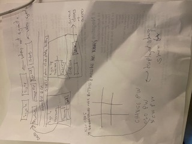

# Objectives
Implement tic-tac-toe logic using existing api for authorization and storing of game.
# Technologies used
* HTML
* CSS / SASS
* JavaScript
  - jQuery
  - AJAX
  - bootstrap

# Planning
I created a list of tasks, mostly based on what was given in class, and executed one at a time.  I made a schedule to determine which days I would do on what tasks.  As I tested and reviewed the application, I added my own tasks.  I implemented small features and tested and committed as I went along.  I also created a test plan.  At the end of the project, I reviewed the requirements line by line, created a test plan, and manually executed.

# Wireframe

# Test Plan
See [Test Plan (file: TESTS.md)](./TESTS.md)

# Problem Solving
For problem solving:
* Error messages: Trace down the error.
* Unexpected behavior: Either walk through the code from beginning of code or end of code.  Also, use console.log to see if values are as expected.

# Unsolved problems
Letters are not centered horizontally.  Ui could be more attractive.

# User Stories
* As a game enthusiast, I would like to be able to play tic tac toe on the computer, so that I can learn to play.  Acceptance criteria: Can put Xs and Os alternatively on the board and indicate when game is complete.
* As a game enthusiast, I would like to be able to see results to see how I am improving.
* As a game enthusiast, I would like to be able to create an account so I can come back later and see my results
* As a user, I would like to be able to change my password so that I can be secure.
* As a user, I would like to be able to sign out so that I can be secure.
